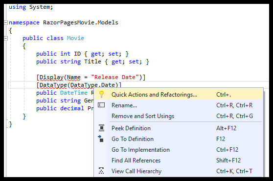
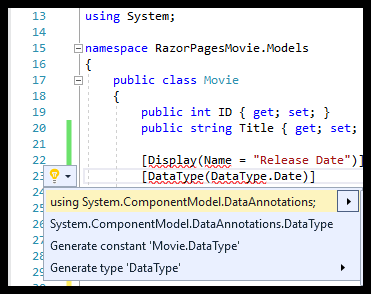
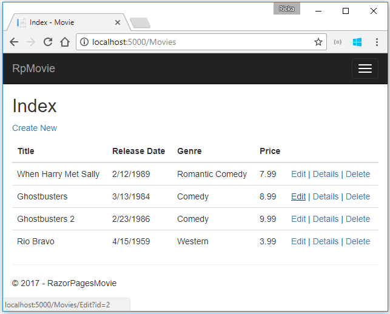

# Controller methods and views

By [Rick Anderson](https://twitter.com/RickAndMSFT)

We have a good start to the movie app, but the presentation is not ideal. We don't want to see the time (12:00:00 AM in the image below) and **ReleaseDate** should be **Release Date** (two words).


Open the *Models/Movie.cs* file and add the highlighted lines shown below:

[!code-csharp[Main](razor-pages-start/sample/RazorPagesMovie/MovieDate?name=snippet_1&highlight=10-11)]

Right click on a red squiggly line **> Quick Actions and Refactorings**.

  


Select `using System.ComponentModel.DataAnnotations;`

  

  Visual studio adds `using System.ComponentModel.DataAnnotations;`.

We'll cover [DataAnnotations](http://msdn.microsoft.com/library/system.componentmodel.dataannotations.aspx) in the next tutorial. The [Display](https://msdn.microsoft.com/library/system.componentmodel.dataannotations.displayattribute.aspx) attribute specifies what to display for the name of a field (in this case "Release Date" instead of "ReleaseDate"). The [DataType](https://msdn.microsoft.com/library/system.componentmodel.dataannotations.datatypeattribute.aspx) attribute specifies the type of the data (Date), so the time information stored in the field is not displayed.

Browse to `Pages/Movies` and hold the mouse pointer over an **Edit** link to see the target URL.



The **Edit**, **Details**, and **Delete** links are generated by the [Anchor Tag Helper](mvc/views/tag-helpers/built-in/anchortaghelper) in the *Pages/Movies/Index.cshtml* file.

[!code-cshtml[Main](razor-pages-start\snapshot_sample\RazorPagesMovie\Pages\Movie\Index.cshtml?highlight=16-18&range=32-)]

[Tag Helpers](xref:mvc/views/tag-helpers/intro) enable server-side code to participate in creating and rendering HTML elements in Razor files. In the code above, the `AnchorTagHelper` dynamically generates the HTML `href` attribute value from the controller action method and route id. You use **View Source** from your favorite browser or use the developer tools to examine the generated markup. A portion of the generated HTML is shown below:

```html
<td>
  <a href="/Movies/Edit?id=1">Edit</a> |
  <a href="/Movies/Details?id=1">Details</a> |
  <a href="/Movies/Delete?id=1">Delete</a>
</td>

```


>[!div class="step-by-step"]
[Working with SQL Server LocalDB](xref:tutorials/razor-pages/sql)